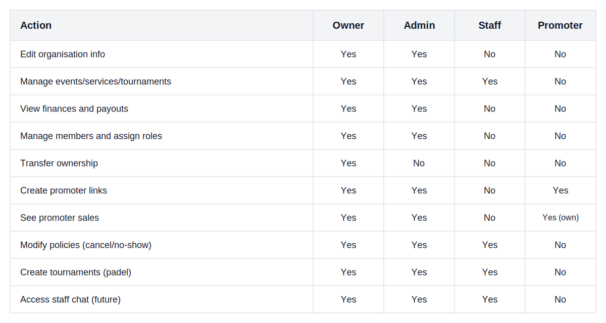

# ORYA v1 Product Specification (MVP)

This document outlines the final structure and behaviour of the ORYA platform for its v1 launch. It summarises the agreed-upon architecture, navigation and data model, reflecting all decisions taken. It is designed to serve both mobile and desktop clients. It defines the minimum feature set required to launch without confusion and leaves room for future expansion.

## 1. Vision and Positioning

ORYA is a social network for real-world experiences where users discover and book events, services and padel tournaments. It combines aspects of a social feed, ticketing platform and booking engine.

- User-centric: every feature begins with the end user. Organisations and clubs are composed of users; nothing exists outside of a user context.
- Feed-first: the app opens with a personalised feed showing trending items, upcoming bookings and what people you follow are doing; a map is deferred to a later phase.
- Categories ("Mundos"): discovery is organised into distinct worlds - Events, Padel and Reservations (services), with Nightlife treated as a template within Events rather than a separate world.
- Privacy: bookings/reservations made by a user are always private unless explicitly shared. Social activity is opt-in and honours the user's privacy settings.

## 2. Entity Model (High-level)

### Users

- User: base entity. Stores authentication data, display name, username (@), avatar and basic preferences.
- UserProfile: holds bio, city and optional Padel attributes (level, dominant hand, position). The padel fields are only required when a user participates in a tournament or activates padel mode.
- Follow: represents a one-way follow relationship. A mutual follow equates to a reciprocal follow. Users can control who sees their activity (public / followers / private).
- UserActivity: stores events such as RSVP, ticket purchases and padel achievements. Activities shown to followers respect privacy settings.
- Notifications: alerts for follows, RSVP confirmations, ticket purchases, invitations and other relevant events.

### Organisations

- Organization: represents a group such as a business, event promoter or padel club. Each organisation has a primary category and optional secondary modules. Key fields: name, slug, category, description, branding (logo, cover), status (active / suspended) and Stripe Connect ID (for payouts).
- OrgMembership: links a user to an organisation with a role (Owner, Admin, Staff, Promoter) and status (invited, accepted, removed). There must always be at least one Owner.
- OrgRole:
  - Owner - full control, can transfer ownership, see finances, manage members, edit anything.
  - Admin - operational control: manage events/services/tournaments, view finances, invite members. Cannot transfer ownership.
  - Staff - limited control: manage events/services/tournaments depending on the organisation type, but cannot see finances.
  - Promoter - generate tracking links, see their own sales. Cannot edit core organisation data or finances.
- AuditLog: records sensitive actions (ownership transfers, role changes, policy changes, payouts). Used for accountability.
- OrgPolicy: holds default and custom policies for cancellations and refunds. Three template types - Flexible, Moderate and Rigid - are provided; organisations can create additional policies.
- Review: optional, user-submitted rating and text about an organisation. Reviews are displayed on the organisation's public profile once moderation is added (not a priority for v1).

### Payments and Financials

- PaymentCustomer: connects a user to Stripe's customer object.
- ConnectAccount: connects an organisation to Stripe Connect for direct payouts.
- Transaction: stores the details of every payment (amount, Stripe charge ID, fee to ORYA, fee to Stripe, payout status). Only Owners and Admins see transactions.
- PayoutRecord: summarises payouts to the organisation; automated via Stripe Connect.
- SplitPayment: used in padel and other scenarios where multiple participants contribute. Contains a list of participants, each with their payable share and status (paid, pending). The default model charges the captain (creator) for the full amount if others fail to pay; a pre-authorisation model can be introduced later.

### Modules

#### Events

- Event: core event object (title, description, date/time, venue, capacity, category/template, organiser ID). Supports multiple ticket types.
- TicketType (aka waves): defines price, quantity and availability window.
- Order: links a user to purchased tickets. Contains user ID, organisation ID, event ID, total amount, status.
- Ticket: individual ticket with QR code, status (valid/used/refunded), and associated Order.
- CheckIn: records when a ticket is scanned at entry (optional for v1 but table exists).

#### Reservations (Services)

- Service: service or resource offered by a business (e.g. manicure, haircut, meeting room). Fields: name, description, duration, price, associated staff (optional).
- Availability: holds time slots (date/time, duration, capacity, status) per service.
- Booking: user booking. Fields: service ID, organisation ID, user ID, slot/time, price, status (pending, confirmed, cancelled).
- Reservation payment: immediate at checkout to secure the slot.
- BookingPolicyRef: pointer to the policy used for cancellation/no-show.

#### Padel

- Tournament: tournament organised by a club or user. Fields: name, date range, category (mixed/men/women), format, registration fee.
- Division: divisions/levels within a tournament.
- Pair: pair/team entry; references two users.
- Match: holds scores and results.
- PadelPlayerProfile: stores padel-specific data about a user when they participate (level, dominant hand, preferred side, stats). Created on first participation.
- RankingSnapshot: periodic snapshot of rankings; allows ranking tables and historical progress.

## 3. Navigation and User Interface

### Mobile (bottom navigation)

- Início - personalised feed combining social updates and personal agenda. See section 4 for layout.
- Descobrir - tab for discovery; shows lists of items across the worlds (Events, Padel, Reservations). Users switch between worlds via chips/tabs at the top. Nightlife appears as a template under Events.
- + Criar - action button that opens a sheet. Options depend on the user's roles/organisations: create event, create reservation/service, create tournament, create promoter link.
- Social - notifications and social interactions: activity, follow requests, suggestions, search for users.
- Perfil - user account page; shows upcoming events/reservations, favourites, padel stats (if activated) and "As minhas organizações."

Top bar includes icons for notifications; chat is omitted in v1 to avoid complexity.

### Desktop (sidebar)

Left sidebar lists: Início, Descobrir, Social, Perfil.

A prominent Criar button appears in the top right (analogous to mobile "+").

Organisation workspace opens in the same interface with its own sidebar.

### Organisation Workspace (Modo Organização)

When a user enters an organisation, navigation switches to a four-tab layout within the workspace:

- Painel - high-level metrics: upcoming events/bookings/tournaments, revenue this week, conversion rates; quick actions.
- Gestão - different sub-sections depending on the organisation's primary category:
  - Eventos: list of events (future and past), create/edit event, manage ticket waves and check-ins.
  - Reservas: calendar/agenda view, manage services/resources, view bookings, set policies.
  - Padel Clube: tournaments list, ranking board, player roster, manage courts (if relevant).
- Equipa - manage members; invite new users; assign roles; view logs of role changes.
- Relatórios/Finanças - view transactions and payouts (Owner/Admin only). Shows fees taken by ORYA and Stripe.

The user can exit the workspace via a clear "Sair do modo organização" button to return to the personal app.

## 4. Page Layouts and Core Flows

### 4.1 Início (Home Feed)

- Em Alta: curated or algorithmic section displaying trending events, services or tournaments near the user's city. For v1 this list is manually curated.
- Para ti: personal dashboard showing:
  - Próximos Eventos: list of purchased or RSVP'd events.
  - Próximas Reservas: upcoming service bookings (visible only to the user).
  - Padel: if the user has a padel profile, show upcoming tournaments or current ranking.
  - Onde quem segues vai: summarises public activities of followed people (respecting privacy settings) such as purchased tickets or joined tournaments.
  - Sugestões: recommended organisations or events based on interests and interactions.
- Posts curtos: micro-posts from organisers (announcements, promotions) and user comments. Each includes action buttons: Comprar (for events), Reservar (for services), Inscrever-me (for tournaments) or Juntar-me (for social suggestions).

### 4.2 Descobrir

The discovery page uses a search bar and world tabs. Each world has its own list and filters:

- Eventos: cards showing event name, date, organiser, price; templates adjust for Nightlife (with VIP/Guest list options). Filters: Today, This week, Price range, Category.
- Padel: tournaments list, public club courts, community games. Filters: date, level, format (mixed/men/women).
- Reservas: services (hair, beauty, fitness, etc.) with available times; filters: service type, date, price.

### 4.3 Social (Activity and Suggestions)

Tabs within Social:

- Atividade - chronological feed of social interactions (follows, event RSVPs from people you follow, tournament wins, etc.). Booking activity remains private.
- Pedidos - follow requests, organisation invites, promoter invites.
- Sugestões - recommended users based on location, interests and mutual followers. Each suggestion shows the number of mutuals and a follow button.
- Search - search bar to find users. Optionally includes organisation search.

### 4.4 Perfil (User Profile)

Contains:

- Header: avatar, name, @username, "editar perfil".
- Próximos - cards summarising upcoming events and reservations. Each card links to the detail page and includes CTAs (download ticket, manage booking, etc.). Visible only to the user.
- Favourites - list of favourite events, services and organisations.
- Padel - appears only if the user has an active padel profile; shows ranking position, latest tournaments and statistics.
- As Minhas Organizações - lists organisations where the user has a role, with badges (Owner/Admin/etc.). Clicking enters the Modo Organização for that org.

### 4.5 Organisation Public Profiles

#### Organização (Events)

- Cover, logo, short description.
- Upcoming events (with price and CTA Comprar).
- Past events (collapsed by default).
- Reviews (if enabled).

#### Negócio (Reservations)

- Services offered (with durations and prices).
- Calendar or list of next available slots.
- CTA Reservar leading to booking flow.

#### Clube Padel

- Overview: description, location, contact.
- Active tournaments (list with CTA Inscrever-me).
- Ranking board / hall of fame.
- Registered players (avatars).

### 4.6 Event Detail and Ticket Purchase

- Event name, banner, organiser name, date/time, venue, description.
- Ticket options (waves) showing price, quantity remaining and sales period.
- CTA Comprar; after checkout, show confirmation and ticket details with QR code.
- Optional: show promoter codes entry field (template Nightlife).

### 4.7 Service Detail and Booking

- Service name, description, duration, price.
- Availability picker (calendar or list) - user selects an open slot.
- Policy summary (name and cancellation window).
- CTA Reservar; after booking, show confirmation screen with date/time, price, policy and contact info.

### 4.8 Tournament Flow (Padel)

- Tournament page with divisions, registration fee, sign-up deadline and rules.
- CTA Inscrever-me; user enters their partner (second player) or chooses random pair; collects fee via Stripe.
- After sign-up, pair appears in the bracket/roster; ranking updates post-tournament.

### 4.9 Split Payments (Padel and future use cases)

- Creator/Captain pays the full amount on checkout (MVP). A warning informs them that, if invited players do not pay by the event date, the remaining amount is charged to the captain's card.
- After payment, invited players receive a request to pay their share via email/app. The system keeps track of each participant's payment status. No refund is automatically triggered when players drop out; the organiser decides via custom policy.

## 5. Financial and Legal Considerations

- All payments are processed via Stripe Connect. ORYA collects its platform fee and Stripe collects its processing fee automatically.
- Currency: EUR only for v1.
- Public price: the displayed price always includes all fees (ORYA + Stripe) and is the final amount.
- Checkout: no fee breakdown is shown to the user; only organisers see fee details in transactions and reports.
- Discount codes: can reduce the total paid; the user sees the applied discount (code/amount), with no fee breakdown.
- No internal wallet or balance; all funds go directly to the organiser's Connect account. Users only see receipts and ticket details.
- Refund policies are defined by the organiser via selectable templates or custom policies. The organiser is always responsible for refunds; ORYA only mediates via the defined policy.
- Chargebacks and fraud handling are delegated to Stripe; however, ORYA logs all financial actions for audit.

## 6. Organisation Roles and Permissions Matrix

## 7. Remaining Questions and Final Decisions

- Trending (Em Alta) algorithm - initially, this list will be curated manually or generated based on ticket sales and browsing metrics until a robust recommendation system is built.
- Check-in - scanning tickets for entry is part of the event management module. The table and UI are ready, but scanning may be disabled in the very first release if development time is limited; it can be toggled on later.
- Inviting Users to Organisations - organisations can invite users via email or in-app notification. Invites require acceptance. Roles are assigned upon acceptance. Users can also request to join, pending approval by an Owner/Admin.
- Clubes tab - omitted from the bottom navigation in the MVP. Clubs exist as organisations but have no separate tab. This feature is reserved for a later release when the community aspect is expanded.
- Chat - entirely excluded from the MVP. Only notifications and comments exist. Real-time chat can be introduced after evaluating usage patterns and infrastructure costs.

## 8. Post-MVP Roadmap Ideas

- Map view for discovery with geolocation and clustering.
- Experiências públicas created by users with moderation tools.
- Clubes as a first-class citizen with feeds, events and group chats.
- Real-time chat between users, staff, promoters and organisers.
- Automated payouts to promoters with threshold and scheduling options.
- Marketing tools for organisers (email campaigns, push notifications).
- Advanced rankings for padel with points per match, head-to-head stats and badges.

This specification captures all the decisions and structures required for ORYA v1. Each page and module is intentionally scoped to deliver a cohesive user experience without over-engineering. Future features have clear placeholders but will not be included until the base is stable and intuitive.
